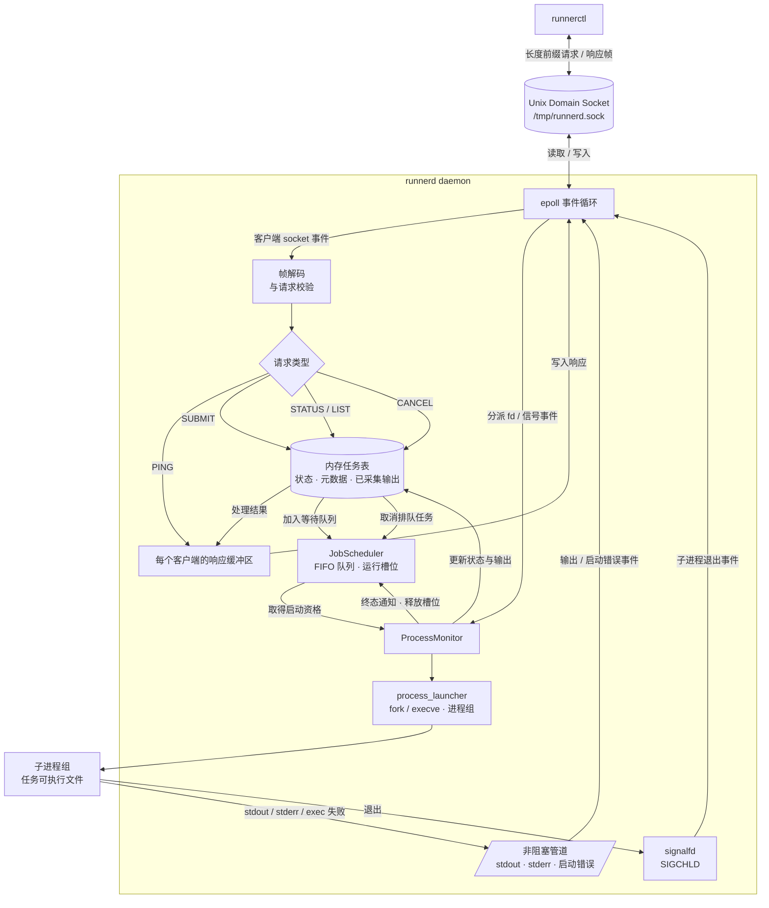

<div align="center">

# runnerd

**一个用于启动、监管和查询本地任务的事件驱动 Linux 守护服务。**

[English](README_EN.md) | 简体中文


[](https://github.com/qxf-72/runnerd/actions/workflows/ci.yml)

[](LICENSE)

[快速开始](#-快速开始) · [架构](#-架构) · [文档](#-文档) · [路线图](#-路线图)

</div>

`runnerd` 是一个面向单机、单用户场景的任务执行服务。客户端
`runnerctl` 通过 Unix Domain Socket 提交命令，daemon 负责启动、监控和回收
对应的子进程。

> [!WARNING]
> **实验性软件。** `runnerd` 仅适用于可信的单用户 Linux 环境。目前没有认证、
> 沙箱隔离、持久化、真正生效的执行超时机制，也没有输出大小限制；请勿将其暴露给
> 不受信任的用户或工作负载。

## ✨ 为什么选择 runnerd？

`runnerd` 将进程监管保持在本机，并把关键行为显式化。它是一个聚焦 Linux
进程管理的参考实现，而不是通用调度器或远程执行平台。

| 能力 | 提供的价值 |
| --- | --- |
| 本地 IPC | 使用可自定义路径的 Unix Domain Socket；socket 文件以 `0600` 权限创建。 |
| 事件驱动 I/O | 一个 LT `epoll` 事件循环同时服务客户端与子进程管道，不阻塞主循环。 |
| 可靠分帧 | 长度前缀协议和增量解码正确处理拆包、粘包及二进制 payload。 |
| 进程监管 | 通过 `fork/execve` 和独立进程组启动任务，全程不经过 shell。 |
| 有界并发 | `--max-running` 设置运行槽位，超额任务进入 FIFO 等待队列。 |
| 排队取消 | `runnerctl cancel` 可以安全移除尚未启动的任务，并将其标记为 `CANCELLED`。 |
| 可观测生命周期 | `signalfd + waitpid` 配合非阻塞 stdout/stderr 管道，驱动有文档说明的任务状态机。 |
| 可验证行为 | GoogleTest 与 CTest 覆盖协议、状态转移、进程启动、监控和端到端流程。 |

## 🚀 快速开始

### 环境要求

- Linux
- 支持 C++17 的 GCC 或 Clang
- CMake 3.16 或更高版本

### 构建

```bash
git clone https://github.com/qxf-72/runnerd.git
cd runnerd

cmake -S . -B build -DCMAKE_BUILD_TYPE=Release
cmake --build build --parallel
```

首次配置会通过 `FetchContent` 下载 GoogleTest，因此需要能够访问 GitHub。

### 运行任务

在第一个终端启动 daemon：

```bash
./build/runnerd --max-running 2
```

`--max-running` 必须是正整数，默认值为 `1`。

在第二个终端检查连接、提交任务并查询状态：

```bash
./build/runnerctl ping
# PONG

./build/runnerctl submit -- /bin/sleep 10
# 1

./build/runnerctl status 1
./build/runnerctl list
```

默认 socket 路径为 `/tmp/runnerd.sock`。如需使用其他路径，服务端和客户端必须
使用同一个参数：

```bash
./build/runnerd --socket /tmp/runnerd-demo.sock --max-running 2
./build/runnerctl --socket /tmp/runnerd-demo.sock ping
```

`--` 表示 `runnerctl` 自身的选项到此结束，其后每一项都会成为任务的 `argv`。
可执行文件（`argv[0]`）必须是绝对路径。

### 使用说明

- `runnerd` 不经过 shell 执行任务。因此 `|`、`>`、`$VAR` 等 shell 语法不会被解释，
  而是作为普通参数传给目标程序。
- 客户端断开连接不会取消已提交的任务；任务仍由 daemon 继续监管。
- daemon 会采集 stdout/stderr，但当前 `runnerctl` 只能查询状态和元数据，不能读取输出正文。
- 运行任务进入终态后会释放运行槽位，daemon 随即按 FIFO 顺序启动等待队首。
- `runnerctl cancel <job_id>` 目前只取消仍处于 `QUEUED` 的任务；运行中的任务不会被终止。

## 🏗️ 架构



客户端 socket、子进程输出管道和 `SIGCHLD` 都由同一个 `epoll` 循环监听。
`SUBMIT` 创建任务并加入 `JobScheduler`；调度器在有空闲槽位时把 FIFO 队首交给
`ProcessMonitor` 启动与监管。`STATUS` 和 `LIST` 只读取内存任务表。客户端断开连接
不会终止已提交的任务；只有子进程退出且所有受监控管道均到达 EOF 后，任务才会结算。
`ProcessMonitor` 随后通知 daemon 释放运行槽位，daemon 再继续启动 FIFO 队首任务。

## 🧩 项目结构

| 路径或模块 | 职责 |
| --- | --- |
| `include/runnerd/` | 协议、任务、进程和 Unix Socket 模块的公共声明。 |
| `src/protocol.cpp` | 长度前缀帧、请求编码与增量解码。 |
| `src/job.cpp` | `JobSpec` 校验、任务模型和状态转移规则。 |
| `src/job_scheduler.cpp` | FIFO 等待顺序、最大并发槽位和排队任务移除。 |
| `src/process_launcher.cpp` | pipe、`fork/execve`、标准流重定向和进程组创建。 |
| `src/process_monitor.cpp` | `epoll` 注册、输出采集、`SIGCHLD` 处理与任务结算。 |
| `src/runnerd_main.cpp` | daemon 入口和事件循环。 |
| `src/runnerctl_main.cpp` | 命令行客户端和用户可见的输出。 |
| `tests/` | 单元测试与真实 daemon 的端到端集成测试。 |

## 🔌 命令与协议

| 命令 | 说明 |
| --- | --- |
| `runnerd [--socket <path>] [--max-running <N>]` | 启动 daemon；`N` 默认为 `1`。 |
| `runnerctl ping` | 检查 daemon 是否可达。 |
| `runnerctl submit [--timeout <ms>] -- <absolute-path> [args...]` | 提交任务并返回 JobId。 |
| `runnerctl status <job_id>` | 返回单个任务的当前状态或终态。 |
| `runnerctl list` | 按 JobId 顺序列出全部内存任务。 |
| `runnerctl cancel <job_id>` | 取消一个尚未启动的 `QUEUED` 任务。 |

底层使用 Unix Domain Stream Socket。每条消息由 4 字节大端 payload 长度和最大
64 KiB 的 payload 组成：

```text
[ payload length: uint32 big-endian ][ payload bytes ]
```

当前支持 `PING`、`SUBMIT`、`STATUS`、`LIST` 和 `CANCEL`。非法请求会返回
`ERR <message>`。`FrameDecoder` 能跨多次读取组装单帧，也能从一次读取中解码
多帧。

### 任务生命周期

合法任务会先获得 JobId 并进入 `QUEUED`，启动成功后进入 `RUNNING`。子进程以
退出码 `0` 退出时任务变为 `SUCCEEDED`；启动失败、非零退出码或被信号终止时则为
`FAILED`。启动前发生资源创建或注册失败时，任务也可以直接从 `QUEUED` 进入
`FAILED`；尚未启动的任务被取消时会从 `QUEUED` 进入 `CANCELLED`。

```text
QUEUED ──> RUNNING ──> SUCCEEDED
   │          └──────> FAILED
   ├─────────────────> FAILED
   └─────────────────> CANCELLED
```

`status` 会返回 JobId 和状态；在字段可用时，还会包含 PID、超时配置、退出码、
退出信号或启动失败信息。终态任务还会记录已采集 stdout/stderr 的字节数。

### 线协议摘要

| 请求 | 成功响应 |
| --- | --- |
| `PING` | `PONG` |
| `SUBMIT + timeout_ms + argc + argv` | `OK <job_id>` |
| `STATUS + job_id` | `OK id=<id> state=<state> ...` |
| `LIST` | `OK`，后跟按 JobId 排序的任务摘要 |
| `CANCEL + job_id` | `OK cancelled` |

`SUBMIT` 中的整数和参数长度以及 `STATUS`、`CANCEL` 中的 JobId 均使用大端
无符号整数；`timeout_ms = 0` 表示未配置超时。Unix Domain **Stream** Socket
不保留消息边界，因此客户端和服务端均通过 `FrameDecoder` 处理拆包与粘包。

## 🧭 项目状态与边界

项目有意聚焦于本地单用户 daemon。下列限制是当前真实行为，而非隐藏的取舍：

| 领域 | 当前行为 |
| --- | --- |
| 超时 | `--timeout` 会被校验并保存到 `JobSpec`，但目前不会终止超时任务。 |
| 调度 | `--max-running` 限制并发运行数；超额任务按 FIFO 保持 `QUEUED`，运行任务结算后自动释放槽位并启动队首。 |
| 任务数据 | 任务元数据和已采集输出仅保存在内存中，daemon 重启后丢失。 |
| 输出 | stdout/stderr 会被采集，但暂不能通过 `runnerctl` 查询，且未设大小上限。 |
| 控制 | `QUEUED` 任务可以取消；运行中任务的进程组终止流程尚未实现，因此取消请求会被拒绝。 |
| 安全模型 | socket 为本地 `0600` 文件，但没有认证、容器隔离、cgroup 或多用户授权。 |

明确不在范围内的能力包括：TCP 远程访问、HTTP 或 Web UI、数据库、分布式 Agent、
线程池、任务依赖 DAG、自动重试和多用户登录。

## 🛠️ 开发

### 运行测试

```bash
cmake -S . -B build -DCMAKE_BUILD_TYPE=Debug
cmake --build build --parallel
cmake -E chdir build ctest --output-on-failure
```

GitHub Actions 会在每次 push 和 Pull Request 时，在 Ubuntu 上执行相同的配置、
编译和测试流程。

测试套件使用 GoogleTest 1.17.0。首次 CMake 配置时，`FetchContent` 会下载并校验
该依赖；后续配置会复用构建目录中的副本。

### CMake 配置

`BUILD_TESTING` 默认开启。如只需要构建 `runnerd` 和 `runnerctl`，且不希望下载
GoogleTest，可关闭测试目标：

```bash
cmake -S . -B build -DCMAKE_BUILD_TYPE=Release -DBUILD_TESTING=OFF
cmake --build build --parallel
```

项目固定使用 C++17，并禁用编译器扩展；各目标均开启 `-Wall`、`-Wextra` 和
`-Wpedantic`。CMake 会生成 `compile_commands.json`，便于 clangd 等工具读取真实的
编译参数。

| 测试目标 | 主要覆盖内容 |
| --- | --- |
| `smoke_test` | GoogleTest/CTest 最小可用性检查 |
| `protocol_test` | 分帧、SUBMIT/STATUS/CANCEL 编解码与畸形输入 |
| `job_test` | 参数校验、状态转移和终态 |
| `job_scheduler_test` | FIFO 顺序、并发槽位、槽位释放和排队任务移除 |
| `process_launcher_test` | `fork/execve`、管道、进程组和启动失败 |
| `process_monitor_test` | 输出采集、结算、大输出和并发回收 |
| `runnerd_integration_test` | 真实 daemon、任务查询、FIFO 调度、排队取消及失败路径 |

## 📚 文档

| 文档 | 说明 |
| --- | --- |
| [需求说明](docs/requirements.md) | 功能目标、请求约束、当前查询行为和明确的非目标。 |
| [任务状态机](docs/state_machine.md) | 全部状态、合法迁移、终态规则及当前运行时行为。 |
| [进程启动器](docs/process_launcher.md) | 文件描述符所有权、子进程启动顺序和错误上报机制。 |

## 🗺️ 路线图

- [x] Unix Domain Socket 通信、长度前缀分帧和增量解码
- [x] 基于 `epoll` 的多客户端非阻塞 I/O
- [x] 任务模型、状态机和内存任务表
- [x] `fork/execve` 启动、进程组、输出采集和回收
- [x] `STATUS` 与 `LIST` 查询
- [x] FIFO 等待队列、`--max-running`、终态槽位释放与队列自动推进
- [x] `CANCEL` 协议与排队任务取消
- [ ] 运行中任务取消、强制超时、有界输出和输出查询
- [ ] 任务历史持久化与重启恢复
- [ ] 更多失败路径的集成测试、Sanitizer 检查和诊断报告

## 🤝 贡献

欢迎提交 Issue 和 Pull Request。提交 Pull Request 前，请确保项目可以构建并通过完整
测试。对于会改变协议、任务状态机或生命周期语义的改动，请先创建 Issue，说明预期
行为和边界。

## 📄 许可证

本项目采用 [MIT License](LICENSE) 开源。
