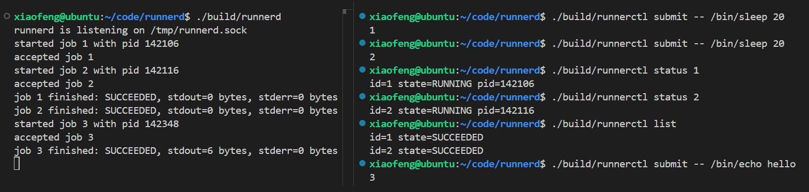

<div align="center">

# runnerd

[English](README_EN.md) | 简体中文

一个使用 C++17 编写的 Linux 本地任务执行守护服务。


[](LICENSE)

</div>

`runnerd` 是一个面向单机、单用户场景的任务执行服务。客户端 `runnerctl`
通过 Unix Domain Socket 提交命令，daemon 负责启动、监控并回收子进程。

> [!NOTE]
> 项目仍处于早期开发阶段，协议和命令行接口可能继续调整。

## ✨ 功能特性

- Unix Domain Socket 本地通信，支持自定义 socket 路径
- 基于非阻塞 I/O 和 LT `epoll` 的多客户端事件循环
- 长度前缀协议与增量解码，正确处理拆包、粘包和二进制 payload
- 支持 `ping`、`submit`、`status` 和 `list`，服务端会再次校验请求
- 使用 `fork/execve` 和独立进程组启动任务，不经过 shell
- 通过非阻塞 pipe 采集 stdout/stderr，使用 `signalfd + waitpid` 回收子进程
- 提供任务状态机、内存任务表以及 GoogleTest/CTest 测试

## 🏗️ 当前架构

```text
runnerctl
    │  Unix Domain Socket + 长度前缀协议
    ▼
runnerd（epoll 事件循环）
    ├── client fd ──────────────> 解码请求、查询任务并缓冲响应
    └── ProcessMonitor
          ├── process_launcher ─> fork / execve ─> 子进程
          ├── process pipes ─────────────────────> 采集输出与启动错误
          └── signalfd ─> waitpid ──────────────> 更新 Job 状态
```

网络连接和子进程 pipe 共用同一个 `epoll` 事件循环。客户端断开不会终止
已经提交的任务；任务结果由 `ProcessMonitor` 在子进程退出且三个监控 pipe
全部到达 EOF 后统一结算。

### 当前限制

- `--timeout` 只会保存到 `JobSpec`，暂时不会终止超时任务
- 没有 `cancel` 和输出查询命令
- 没有并发上限或等待队列，合法任务会立即启动
- 任务和输出只保存在内存中，当前也没有输出大小上限
- daemon 重启后会丢失 JobId 计数、任务状态和输出

## 📁 项目结构

| 模块 | 职责 |
| --- | --- |
| `protocol` | 长度前缀帧及 SUBMIT/STATUS 编解码 |
| `job` | 任务模型、参数校验和状态机 |
| `process_launcher` | pipe、fork、重定向、进程组和 execve |
| `process_monitor` | epoll 注册、输出采集、SIGCHLD 和任务结算 |
| `unix_socket` | Unix Domain Socket 创建与连接 |
| `runnerd_main` | daemon 入口与事件循环 |
| `runnerctl_main` | 命令行客户端 |
| `tests/` | 单元测试和端到端集成测试 |

## 🚀 编译运行

### 环境要求

- Linux
- 支持 C++17 的 GCC 或 Clang
- CMake 3.16 或更高版本

测试使用 GoogleTest 1.17.0。首次启用测试进行 CMake 配置时，
`FetchContent` 会自动下载并校验对应源码，因此需要能够访问 GitHub；
后续配置会复用构建目录中已经下载的依赖。

### 构建项目

```bash
git clone https://github.com/qxf-72/runnerd.git
cd runnerd

cmake -S . -B build -DCMAKE_BUILD_TYPE=Debug
cmake --build build
```

### 运行示例

命令格式：

```text
runnerd [--socket <path>]
runnerctl [--socket <path>] ping
runnerctl [--socket <path>] submit [--timeout <milliseconds>] \
          -- <absolute-path> [arguments...]
runnerctl [--socket <path>] status <job_id>
runnerctl [--socket <path>] list
```

在第一个终端启动 daemon：

```bash
./build/runnerd
```

在第二个终端检查连接并提交任务：

```bash
./build/runnerctl ping                         # 输出 PONG
./build/runnerctl submit -- /bin/echo hello   # 输出 JobId，例如 1
```

提交带有正数毫秒超时配置的任务：

```bash
./build/runnerctl submit --timeout 5000 -- /bin/sleep 1
```

查询单个任务或列出全部任务：

```bash
./build/runnerctl status 1
./build/runnerctl list
```

省略 `--socket` 时默认使用 `/tmp/runnerd.sock`。自定义路径时，服务端和
客户端必须使用相同参数：

```bash
./build/runnerd --socket /tmp/runnerd-demo.sock
./build/runnerctl --socket /tmp/runnerd-demo.sock ping
```

`--` 表示 `runnerctl` 自身的选项到此结束，后面的内容全部属于任务 argv。
`argv[0]` 必须是绝对路径，所以 `echo hello` 和 `./echo hello` 会被拒绝。
stdout/stderr 会由 daemon 采集，但目前还不能通过客户端查询。



### 运行测试

```bash
cmake -E chdir build ctest --output-on-failure
```

当前测试目标包括：

| 测试目标 | 主要覆盖 |
| --- | --- |
| `protocol_test` | 帧、SUBMIT 和 STATUS 编解码及畸形输入 |
| `job_test` | 参数校验、状态迁移和终态判断 |
| `process_launcher_test` | fork/execve、pipe、进程组和启动错误 |
| `process_monitor_test` | 输出采集、退出结算、大输出和并发回收 |
| `runnerd_integration_test` | 真实 daemon、并发 PING、SUBMIT、STATUS 和 LIST |

## 📡 当前协议

Unix Domain Stream Socket 与 TCP 一样不保留消息边界，因此当前协议使用
4 字节大端长度前缀界定 payload，单帧最大为 64 KiB：

```text
[ payload length: uint32 big-endian ][ payload bytes ]
```

| 请求 | 成功响应 |
| --- | --- |
| `PING` | `PONG` |
| `SUBMIT + timeout_ms + argc + argv` | `OK <job_id>` |
| `STATUS + job_id` | `OK id=<id> state=<state> ...` |
| `LIST` | `OK` 后跟按 JobId 排序的任务摘要 |

SUBMIT 中的整数和参数长度同样使用大端无符号整数；`timeout_ms = 0`
表示不设置超时。STATUS 的 JobId 使用 8 字节大端无符号整数。非法请求返回
`ERR <message>`。`FrameDecoder` 支持跨多次读取组装一帧，也能从一次读取中
解析多帧。

## 🎯 设计边界

项目最终定位为同一用户本机上的任务执行服务，明确不计划支持：

- TCP 远程访问
- 多用户登录和权限系统
- HTTP 或 Web UI
- 容器和 cgroup
- 数据库和分布式 Agent
- 线程池、任务依赖 DAG 和自动重试

这些边界让项目可以集中展示 Linux 进程管理、非阻塞 I/O、事件循环和
崩溃恢复等核心能力。

## 🗺️ 路线图

- [x] 初始化 CMake、GoogleTest、CTest、需求文档和状态机文档
- [x] 完成 Unix Domain Socket 与 `PING/PONG` 通信
- [x] 实现长度前缀协议和增量解码
- [x] 使用非阻塞 I/O、连接状态、写缓冲和 `epoll` 支持多个客户端
- [x] 定义任务数据模型、参数校验、状态迁移规则和对应单元测试
- [x] 实现 SUBMIT 编解码、JobId 分配和内存任务表
- [x] 使用 `fork/execve` 启动任务并采集 stdout/stderr
- [x] 实现 STATUS 和 LIST 任务查询
- [ ] 实现并发队列、取消和超时
- [ ] 使用 journal 保存任务历史并支持重启恢复
- [ ] 补充更多异常场景集成测试、Sanitizer 检查和诊断报告

## 📚 文档

- [需求说明](docs/requirements.md)
- [任务状态机](docs/state_machine.md)
- [进程启动器](docs/process_launcher.md)

## 🤝 Contributing

欢迎提交 Issue 和 Pull Request。

提交代码前，请确保项目能够完成构建和测试：

```bash
cmake --build build
cmake -E chdir build ctest --output-on-failure
```

项目仍处于早期阶段。如果改动涉及协议、状态机或任务生命周期，建议先在
Issue 中说明设计和行为边界。

## 📄 License

本项目使用 [MIT License](LICENSE)。
