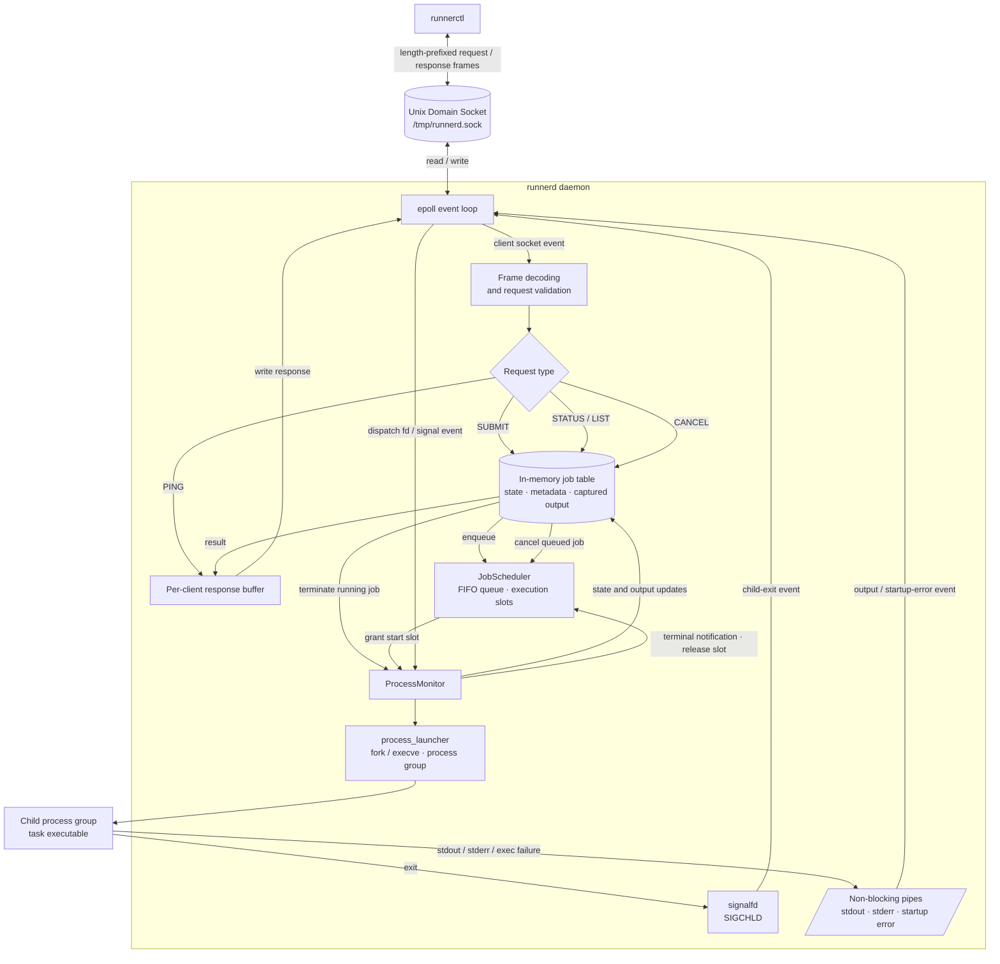

<div align="center">

# runnerd

**An event-driven Linux daemon for launching, supervising, and querying local jobs.**

English | [简体中文](README.md)


[](https://github.com/qxf-72/runnerd/actions/workflows/ci.yml)

[](LICENSE)

[Quick start](#-quick-start) · [Architecture](#-architecture) · [Documentation](#-documentation) · [Roadmap](#-roadmap)

</div>

`runnerd` is a single-host, single-user job execution service. `runnerctl`
submits commands through a Unix Domain Socket; the daemon starts, monitors,
and reaps the resulting child processes.

> [!WARNING]
> **Experimental software.** `runnerd` is intended for a trusted, single-user
> Linux environment. It has no authentication, sandboxing, persistence,
> enforced execution timeout, or output-size limit. Do not expose it to
> untrusted users or workloads.

## ✨ Why runnerd?

`runnerd` keeps process supervision local and explicit. It is a focused
reference implementation for Linux process management rather than a general
purpose scheduler or remote execution platform.

| Capability | What it provides |
| --- | --- |
| Local IPC | A Unix Domain Socket with a configurable path; the socket is created with `0600` permissions. |
| Event-driven I/O | One level-triggered `epoll` loop serves clients and child-process pipes without blocking. |
| Reliable framing | A length-prefixed protocol with incremental decoding handles partial, coalesced, and binary payloads. |
| Process supervision | Jobs use `fork/execve` and a separate process group; no shell is involved. |
| Bounded concurrency | `--max-running` configures execution slots; excess jobs enter a FIFO waiting queue. |
| Job cancellation | Queued jobs are removed directly; running jobs receive process-group `SIGTERM` and settle after their output is drained. |
| Observable lifecycle | `signalfd + waitpid` and non-blocking stdout/stderr pipes drive a documented job state machine. |
| Tested behavior | GoogleTest and CTest cover protocol, state transitions, process launch, monitoring, and end-to-end flows. |

## 🚀 Quick Start

### Requirements

- Linux
- GCC or Clang with C++17 support
- CMake 3.16 or later

### Build

```bash
git clone https://github.com/qxf-72/runnerd.git
cd runnerd

cmake -S . -B build -DCMAKE_BUILD_TYPE=Release
cmake --build build --parallel
```

The first configuration downloads GoogleTest through `FetchContent`, so it
requires access to GitHub.

### Run a job

Start the daemon in one terminal:

```bash
./build/runnerd --max-running 2
```

`--max-running` must be a positive integer and defaults to `1`.

Use a second terminal to check the connection, submit a job, and inspect it:

```bash
./build/runnerctl ping
# PONG

./build/runnerctl submit -- /bin/sleep 10
# 1

./build/runnerctl status 1
./build/runnerctl list
./build/runnerctl cancel 1
```

The default socket path is `/tmp/runnerd.sock`. To use a different path, pass
the same option to both programs:

```bash
./build/runnerd --socket /tmp/runnerd-demo.sock --max-running 2
./build/runnerctl --socket /tmp/runnerd-demo.sock ping
```

`--` ends `runnerctl` option parsing; every following value becomes part of
the job's `argv`. The executable (`argv[0]`) must be an absolute path.

### Usage notes

- `runnerd` does not invoke a shell. Shell syntax such as `|`, `>`, and `$VAR`
  is passed to the target program as ordinary arguments rather than interpreted.
- Disconnecting the client does not cancel a submitted job; the daemon continues
  to supervise it.
- The daemon captures stdout/stderr, but `runnerctl` currently exposes status and
  metadata only, not the output content.
- When a running job reaches a terminal state, its execution slot is released and
  the daemon immediately starts the FIFO head of the waiting queue.
- `runnerctl cancel <job_id>` directly cancels `QUEUED` jobs. For `RUNNING`
  jobs, the daemon sends `SIGTERM` to the entire process group and marks the job
  `CANCELLED` after the child exits and all output is drained.
- There is no grace-period `SIGKILL` escalation yet; a job that ignores
  `SIGTERM` remains `TERMINATING`.

## 🏗️ Architecture



Client sockets, child-process output pipes, and `SIGCHLD` are all observed by
one `epoll` loop. `SUBMIT` creates a job and enqueues it in `JobScheduler`; when
a slot is available, the scheduler hands the FIFO head to `ProcessMonitor` for
launch and supervision. `STATUS` and `LIST` read only from the in-memory job
table. A client disconnect does not terminate a submitted job. A job is settled
only after its child has exited and every monitored pipe reaches EOF.
`ProcessMonitor` then notifies the daemon to release the execution slot, after
which the daemon starts the FIFO head of the waiting queue.
To cancel a running job, `ProcessMonitor` sends `SIGTERM` to the negative
process-group ID, continues draining stdout/stderr, and finally settles the job
from `TERMINATING` to `CANCELLED` according to its termination cause.

## 🧩 Project Structure

| Path or module | Responsibility |
| --- | --- |
| `include/runnerd/` | Public declarations for the protocol, job, process, and Unix Socket modules. |
| `src/protocol.cpp` | Length-prefixed frames, request encoding, and incremental decoding. |
| `src/job.cpp` | `JobSpec` validation, the job model, and state-transition rules. |
| `src/job_scheduler.cpp` | FIFO waiting order, maximum execution slots, and queued-job removal. |
| `src/process_launcher.cpp` | Pipes, `fork/execve`, standard-stream redirection, and process-group setup. |
| `src/process_monitor.cpp` | `epoll` registration, output collection, `SIGCHLD` handling, and job settlement. |
| `src/runnerd_main.cpp` | Daemon entry point and event loop. |
| `src/runnerctl_main.cpp` | Command-line client and user-visible output. |
| `tests/` | Unit tests and end-to-end tests against a real daemon. |

## 🔌 Commands and Protocol

| Command | Description |
| --- | --- |
| `runnerd [--socket <path>] [--max-running <N>]` | Starts the daemon; `N` defaults to `1`. |
| `runnerctl ping` | Checks that the daemon is reachable. |
| `runnerctl submit [--timeout <ms>] -- <absolute-path> [args...]` | Submits a job and returns its JobId. |
| `runnerctl status <job_id>` | Returns one job's current or terminal state. |
| `runnerctl list` | Lists all in-memory jobs in JobId order. |
| `runnerctl cancel <job_id>` | Cancels a `QUEUED` job or requests termination of a `RUNNING` job's process group. |

The transport is a Unix Domain stream socket. Each message has a 4-byte,
big-endian payload length followed by at most 64 KiB of payload:

```text
[ payload length: uint32 big-endian ][ payload bytes ]
```

`PING`, `SUBMIT`, `STATUS`, `LIST`, and `CANCEL` are supported. Invalid requests return
`ERR <message>`. `FrameDecoder` can assemble a frame across reads and decode
several frames from one read.

### Job lifecycle

A valid submission receives a JobId and begins in `QUEUED`; after a successful
launch it becomes `RUNNING`. A child that exits with code `0` reaches
`SUCCEEDED`; startup failures, non-zero exits, and signal termination result in
`FAILED`. A resource-creation or registration failure before launch may also
take a job directly from `QUEUED` to `FAILED`; cancelling a job before launch
takes it from `QUEUED` to `CANCELLED`. Cancelling a running job first moves it
to `TERMINATING`; it reaches `CANCELLED` after process exit and output drain.

```text
QUEUED ──> RUNNING ──> SUCCEEDED
   │          ├──────> FAILED
   │          └──────> TERMINATING ──> CANCELLED
   ├─────────────────> FAILED
   └─────────────────> CANCELLED
```

`status` returns the JobId and state. When available, it also includes the PID,
timeout configuration, exit code, exit signal, or startup-failure details.
Terminal jobs record the number of captured stdout/stderr bytes.

### Wire protocol at a glance

| Request | Successful response |
| --- | --- |
| `PING` | `PONG` |
| `SUBMIT + timeout_ms + argc + argv` | `OK <job_id>` |
| `STATUS + job_id` | `OK id=<id> state=<state> ...` |
| `LIST` | `OK`, followed by JobId-sorted job summaries |
| `CANCEL + job_id` | `OK cancelled` for queued jobs; `OK terminating` for running jobs |

SUBMIT integers and argument lengths, along with JobIds in STATUS and CANCEL,
use unsigned big-endian encoding. `timeout_ms = 0` means no timeout is
configured. A Unix Domain **stream** socket preserves no message boundaries,
so both client and daemon use `FrameDecoder` to handle fragmented and coalesced
frames.

## 🧭 Project Status and Boundaries

The project deliberately focuses on a local, single-user daemon. The following
limitations are current behavior, not hidden trade-offs:

| Area | Current behavior |
| --- | --- |
| Timeouts | `--timeout` is validated and stored in `JobSpec`, but does not terminate jobs yet. |
| Scheduling | `--max-running` limits concurrent execution; excess jobs remain `QUEUED` in FIFO order, and settlement automatically releases a slot and starts the queue head. |
| Job data | Job metadata and captured output exist only in memory and are lost after restart. |
| Output | stdout/stderr are captured, but cannot yet be queried through `runnerctl`; no size limit is applied. |
| Control | `QUEUED` jobs are cancelled directly; `RUNNING` jobs enter `TERMINATING` through process-group `SIGTERM` and become `CANCELLED` after output drain. There is no `SIGKILL` escalation yet, so signal-ignoring jobs remain `TERMINATING`. |
| Security model | The socket is local and mode `0600`, but there is no authentication, container isolation, cgroup, or multi-user authorization. |

Out of scope: remote TCP access, HTTP or Web UI, databases, distributed
agents, thread pools, dependency DAGs, retries, and multi-user login.

## 🛠️ Development

### Run the tests

```bash
cmake -S . -B build -DCMAKE_BUILD_TYPE=Debug
cmake --build build --parallel
cmake -E chdir build ctest --output-on-failure
```

GitHub Actions runs the same configure, build, and test sequence on Ubuntu for
every push and pull request.

The test suite uses GoogleTest 1.17.0. On its first configuration, CMake
`FetchContent` downloads and verifies the dependency; later configurations
reuse the copy in the build directory.

### CMake configuration

`BUILD_TESTING` is enabled by default. To build only `runnerd` and `runnerctl`
without downloading GoogleTest, disable the test targets:

```bash
cmake -S . -B build -DCMAKE_BUILD_TYPE=Release -DBUILD_TESTING=OFF
cmake --build build --parallel
```

The project requires C++17 and disables compiler extensions. Every target uses
`-Wall`, `-Wextra`, and `-Wpedantic`. CMake also generates
`compile_commands.json` for tools such as clangd.

| Test target | Main coverage |
| --- | --- |
| `smoke_test` | Minimal GoogleTest/CTest availability check |
| `protocol_test` | Framing, SUBMIT/STATUS/CANCEL encoding, and malformed input |
| `job_test` | Validation, state transitions, and terminal states |
| `job_scheduler_test` | FIFO order, execution slots, slot release, and queued-job removal |
| `process_launcher_test` | `fork/execve`, pipes, process groups, and startup failures |
| `process_monitor_test` | Output capture, settlement, large output, concurrent reaping, and post-cancel output drain |
| `runnerd_integration_test` | A real daemon, FIFO scheduling, queued and running cancellation, process-group termination, and failure paths |

## 📚 Documentation

| Document | Description |
| --- | --- |
| [Requirements](docs/requirements.md) | Goals, request constraints, current query behavior, and explicit non-goals. |
| [Job state machine](docs/state_machine.md) | Every state, legal transition, terminal-state rule, and current runtime behavior. |
| [Process launcher](docs/process_launcher.md) | File-descriptor ownership, child-launch sequence, and error-reporting mechanism. |

## 🗺️ Roadmap

- [x] Unix Domain Socket transport, length-prefixed framing, and incremental decoding
- [x] Non-blocking multi-client I/O with `epoll`
- [x] Job model, state machine, and in-memory job table
- [x] `fork/execve` launch, process groups, output capture, and reaping
- [x] `STATUS` and `LIST` queries
- [x] FIFO waiting queue, `--max-running`, terminal slot release, and automatic queue advancement
- [x] `CANCEL` protocol, queued cancellation, and process-group `SIGTERM` for running jobs
- [ ] Forced `SIGKILL` escalation, enforced timeouts, bounded output, and output retrieval
- [ ] Persistent job history and restart recovery
- [ ] More failure-path integration tests, Sanitizer checks, and diagnostics

## 🤝 Contributing

Issues and pull requests are welcome. Before opening a pull request, build the
project and run the complete test suite. For changes that affect the protocol,
job state machine, or lifecycle semantics, please open an issue first and
describe the intended behavior and boundaries.

## 📄 License

Distributed under the [MIT License](LICENSE).
